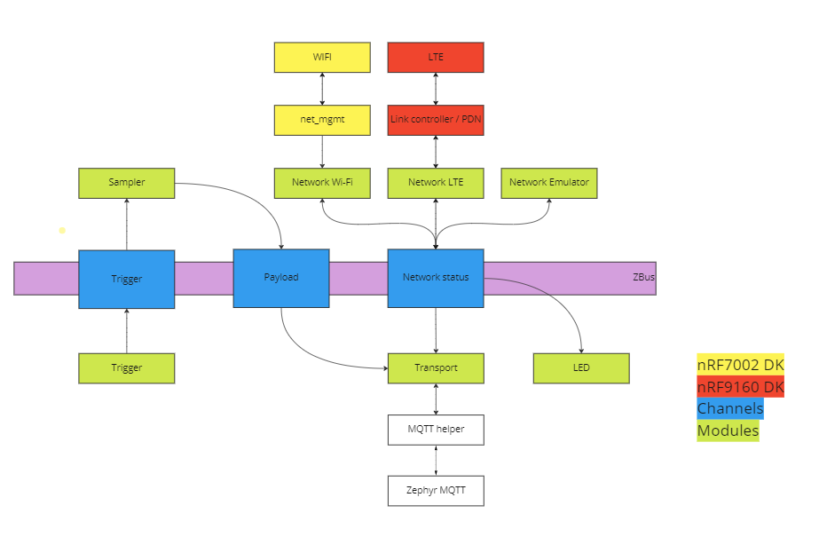
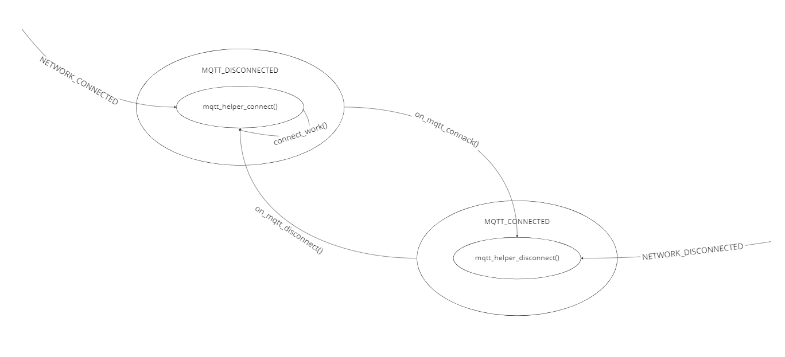
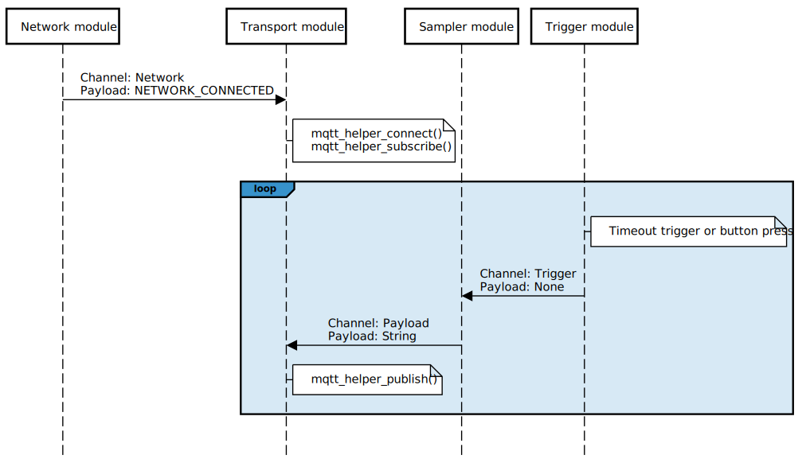

.. _mqtt_sample_architecture:

Architecture
############

The sample has a modular structure, where each module has a defined scope of responsibility.
Communication between modules is handled by the :ref:`zbus` using messages that are passed over *channels*.
If a module has internal state handling its implemented using the :ref:`Zephyr State Machine Framework <smf>`.
Figure :ref:`architecture` illustrates the relationship between modules, channels, and network stacks in the sample.

    Architecture

Channel -definitions and -payloads are owned by the system and placed in a common folder included by all modules, see :file:`src/common/channel.c` and :file:`src/common/channel.h`.

.. note::
    The sample does not include a :file:`main.c`.
    To follow the typical flow of the application see :ref:`mqtt_sample_sequence_diagram`.

Modules
*******

Table :ref:`Module list <mqtt_sample_module_list>` lists all the modules in the sample together with information on each module's channel handling and general behavior.
Common for all the modules in the sample is that they each have a dedicated thread.
The thread is used to initialize functionality specific to each module, and to process incoming messages in case the module is setup as a subscriber.

Subscribers use its thread primarily to monitor and process incoming messages from other modules by continuously polling on :c:func:`zbus_sub_wait`.
When a channel that a module subscribes to is invoked the subscriber will handle the incoming message depending on its content.
The following block of code shows how a module thread polls for incoming messages on subscribed channel:

.. code-block:: c

    static void sampler_task(void)
    {
    	const struct zbus_channel *chan;

    	while (!zbus_sub_wait(&sampler, &chan, K_FOREVER)) {

    		if (&TRIGGER_CHAN == chan) {
    			sample();
    		}
    	}
    }

    K_THREAD_DEFINE(sampler_task_id,
		    CONFIG_MQTT_SAMPLE_SAMPLER_THREAD_STACK_SIZE,
		    sampler_task, NULL, NULL, NULL, 3, 0, 0);

.. note::
    Zbus implements internal message queues for subscribers.
    In some cases, depending on the use case it might be necessary to increase the queue size for a particular subscriber.
    Especially if the module thread can block for some time.
    To increase the message queue assocaited with a subscriber increase the corresponding option, *CONFIG_MQTT_SAMPLE_<MODULE_NAME>_MESSAGE_QUEUE_SIZE*.

Module's that are setup as listeners have dedicated callbacks that is invoked everytime there is a change to a observing channel.
The difference between a listener and a subscriber is that listeners does not require a dedicated thread to process incoming messages.
The callbacks are called in the context of the thread that published the message.
The following block of code shows how a listener is setup in order to listen to changes to the *NETWORK* channel:

.. code-block:: c

    void led_callback(const struct zbus_channel *chan)
    {
    	const enum network_status *status;

    	if (&NETWORK_CHAN == chan) {

    		/* Get network status from channel. */
    		status = zbus_chan_const_msg(chan);

    		switch (*status) {
    		case NETWORK_CONNECTED:
    			__ASSERT_NO_MSG(led_on(led_device, LED_1_GREEN) == 0);
    			break;
    		case NETWORK_DISCONNECTED:
    			__ASSERT_NO_MSG(led_off(led_device, LED_1_GREEN) == 0);
    			break;
    		default:
    			__ASSERT(false, "Unknown event: %d", status);
    			break;
    		}
    	}
    }

    ZBUS_LISTENER_DEFINE(led, led_callback);

A module publishes a message to a channel by calling :c:func:`zbus_chan_pub`.
The following code block shows how this is typically carried out throughout the sample:

.. code-block:: c

    struct payload payload = "Some payload";

    __ASSERT_NO_MSG(zbus_chan_pub(&PAYLOAD_CHAN, &payload, K_SECONDS(1)) == 0);

.. _mqtt_sample_module_list:

+-------------+------------------+-----------------------+-------------------------------------------------------------------------------------------------------------------------------------------------------------------------+
| Module name | Observes channel | Subscriber / Listener | Description                                                                                                                                                             |
+=============+==================+=======================+=========================================================================================================================================================================+
| Trigger     | None             |                       | Sends messages on the trigger channel every :kconfig:option:`CONFIG_MQTT_SAMPLE_TRIGGER_TIMEOUT_SECONDS` and upon a button press.                                       |
+-------------+------------------+-----------------------+-------------------------------------------------------------------------------------------------------------------------------------------------------------------------+
| Sampler     | Trigger          | Subscriber            | Samples data everytime a message is received on the trigger channel.                                                                                                    |
|             |                  |                       | The sampled payload is sent on the payload channel.                                                                                                                     |
+-------------+------------------+-----------------------+-------------------------------------------------------------------------------------------------------------------------------------------------------------------------+
| Transport   | Network          | Subscriber            | Handles MQTT connection. Will auto connect and keep the MQTT connection alive as long as network is available. Receives network status messages on the network channel. |
|             | Payload          |                       | Publishes messages received on the payload channel to a configured MQTT topic.                                                                                          |
+-------------+------------------+-----------------------+-------------------------------------------------------------------------------------------------------------------------------------------------------------------------+
| Network     | None             |                       | Auto connects to either Wi-Fi or LTE after boot, depending on the board and sample configuration. Sends network status messages on the network channel.                 |
+-------------+------------------+-----------------------+-------------------------------------------------------------------------------------------------------------------------------------------------------------------------+
| LED         | Network          | Listener              | Listens to changes in the network status received on the network channel. Displays LED pattern accordingly.                                                             |
|             |                  |                       | If network is connected, LED 1 on the board will light up, green on the Thingy:91.                                                                                      |
+-------------+------------------+-----------------------+-------------------------------------------------------------------------------------------------------------------------------------------------------------------------+

Channels
********

+-----------------+-----------------+------------------------------------------------------------------------+
| Name            | Channel payload | Payload description                                                    |
+=================+=================+========================================================================+
| Trigger channel | None            |                                                                        |
+-----------------+-----------------+------------------------------------------------------------------------+
| Network channel | network status  | Enumerator. Signifies if the network is connected or not.              |
|                 |                 | Can be either NETWORK_CONNECTED or NETWORK_DISCONNECTED                |
+-----------------+-----------------+------------------------------------------------------------------------+
| Payload channel | string          | String buffer that contains a message that is sent to the MQTT broker. |
+-----------------+-----------------+------------------------------------------------------------------------+

States
******

Currently, only the sample's Transport module implements state handling.

Transport module
================

    Transport module state transitions

.. _mqtt_sample_sequence_diagram:

Sequence diagram
****************

The following sequence diagram illustrates the most significant chain of events during normal operation of the sample.

   Sequence diagram
